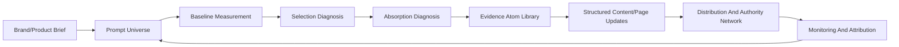

# GEO Method Map

This note turns the saved materials into a working map for GEO Lab.

## Working Definition

GEO means optimizing how a brand, product, page, or knowledge asset appears inside generative AI answers.

The target is not just classic ranking. The target includes:

- whether AI finds the source,
- whether AI selects/cites the source,
- whether AI absorbs facts from the source,
- whether the brand/product is mentioned accurately,
- whether the answer positions the brand positively or negatively,
- whether the evidence can be audited later.

## Core Pipeline

## Six-Layer Architecture

1. Strategy and boundary
2. Prompt graph / Prompt Universe
3. Knowledge assets / evidence atoms
4. Structure and evidence design
5. Authority network and distribution
6. Measurement, attribution, and governance

## Ten Practical Modules

| Module | Purpose | Main Artifact |
|---|---|---|
| M1 GEO project boundary | Define target platforms, user intents, competitors, risks | Project charter |
| M2 Prompt Universe | Convert keywords into real user questions | Prompt table |
| M3 Baseline measurement | Capture current AI answer visibility | Baseline dataset |
| M4 Entity and fact library | Normalize brand/product/facts | Fact cards |
| M5 Evidence atoms | Bind claims to proof and source | Evidence atom cards |
| M6 Content model | Build reusable answer-ready blocks | Page/content templates |
| M7 Technical accessibility | Ensure pages can be crawled and understood | Technical audit |
| M8 Authority network | Build self-owned and third-party source graph | Source map |
| M9 Monitoring and attribution | Track mention/citation/absorption over time | Monitoring report |
| M10 Governance | Avoid stale, false, risky, or fabricated claims | Review log |

## Selection vs Absorption

The measurement framework document makes one distinction central:

- Selection: a platform triggers search and chooses/cites a source.
- Absorption: the cited source actually contributes facts, wording, structure, or evidence to the generated answer.

This matters because a page can be cited but not really shape the answer. A good GEO project should measure both.

## Content Engineering Rules

High-value GEO content should include:

- clear definition,
- concise summary,
- structured headings,
- answer-level paragraphs,
- statistics with source and time range,
- quotes with original source,
- tables/comparisons,
- steps/how-to blocks,
- FAQ,
- limitations and risk boundaries,
- author/update/provenance information.

## What Not To Do

- Do not stuff keywords.
- Do not fabricate third-party media, expert quotes, customer cases, rankings, or data.
- Do not hide prompt-injection text in pages.
- Do not claim that schema, llms.txt, or one article guarantees AI recommendations.
- Do not measure once and call it truth.

## Practical Product Translation

The first sellable workflow should be:

1. GEO diagnosis report.
2. Evidence-bound content/page repair plan.
3. Monthly or quarterly visibility monitoring.

The first software version should output:

- `brand-brief.yaml`
- `prompt-universe.csv`
- `diag-report.json`
- `GEO-diagnosis-report.html`
- `evidence/`

