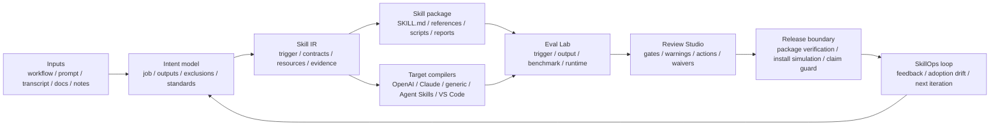

# Yao Meta Skill

[](https://github.com/yaojingang/yao-meta-skill/actions/workflows/test.yml)
[](LICENSE)
[](README.md)
[](docs/README.zh-CN.md)
[](docs/README.ja-JP.md)
[](docs/README.fr-FR.md)
[](docs/README.ru-RU.md)

`YAO` stands for `Yielding AI Outcomes` — the goal is not to generate more prompt text, but to produce reusable AI assets and real operational outcomes.

`yao-meta-skill` creates, evaluates, packages, and governs reusable agent skills. The 1.0 line focused on turning repeated workflows into installable, readable, cross-platform skill packages. The 2.0 line expands that factory into a Skill OS: a governed system for modeling a skill once, compiling it for multiple targets, testing its behavior, reviewing its release evidence, and tracking the next iteration.

[Quick Start](#quick-start) · [Skill OS 2.0](#skill-os-20-upgrade) · [1.0 vs 2.0](#from-10-to-20) · [Operator UX](#operator-ux-commands) · [Benchmark](#weighted-quality-benchmark) · [Examples](examples/README.md) · [Evals](evals/README.md) · [Failure Library](failures/README.md) · [Method Doctrine](#method-doctrine)

## Skill OS 2.0 Upgrade

Skill OS 2.0 keeps the original promise of `yao-meta-skill`, but makes the package lifecycle more explicit. Instead of stopping at `SKILL.md`, it adds a semantic contract, target compilers, evaluation evidence, release gates, and operation reports around the skill.

- **Skill IR**: a platform-neutral intermediate representation for intent, triggers, inputs, outputs, boundaries, references, and expected artifacts.
- **Target compilers and adapters**: generated surfaces for OpenAI, Claude, generic agent skills, Agent Skills compatible packages, and VS Code-oriented workflows.
- **Output Eval Lab**: trigger checks, output assertions, execution evidence, timing and token evidence, benchmark reproducibility, blind-review packs, answer keys, and adjudication reports.
- **Review Studio 2.0**: a single HTML gate page for intent, triggers, output eval, context cost, runtime checks, trust, Skill Atlas signals, adoption drift, waivers, annotations, release evidence, warnings, blockers, and fix actions.
- **Evidence and release governance**: evidence consistency checks, package verification, install simulation, runtime permission probes, world-class evidence intake, world-class ledger, operator runbook, and public claim guard.
- **SkillOps loop**: metadata-only adoption drift, telemetry hooks, adaptive proposals, daily and weekly curator reports, and portfolio-level drift signals.

Current posture: the repository is ready for beta and external testing, while stronger public "world-class" claims remain evidence-gated. Provider-backed production evidence, human blind-review evidence, native permission execution, and real-client telemetry are tracked as separate evidence tasks instead of being treated as completed work.

See the companion artifacts:

- [Visual 1.0 vs 2.0 comparison report](.previews/yao-meta-skill-2-comparison/index.html)
- [Chinese desktop preview](.previews/yao-meta-skill-2-comparison/yao-meta-skill-1-vs-2.png)
- [English desktop preview](.previews/yao-meta-skill-2-comparison/yao-meta-skill-1-vs-2-en.png)

## From 1.0 to 2.0

| Dimension | 1.0 focus | 2.0 upgrade |
| --- | --- | --- |
| Product role | Create, refactor, evaluate, and package reusable skills. | Govern the full lifecycle of a skill: creation, compilation, evaluation, review, release, telemetry, and iteration. |
| Architecture | `SKILL.md`, `agents/interface.yaml`, manifest files, and report artifacts. | Skill IR, target compilers, adapters, gate contracts, evidence ledgers, release locks, and action-oriented review pages. |
| Cross-platform delivery | OpenAI, Claude, and generic package targets. | Adds broader Agent Skills and VS Code-oriented compatibility, with registry-readable compatibility records. |
| Quality model | Trigger and structure checks plus report-based review. | Output eval, benchmark reproducibility, execution evidence, failure disclosure, blind-review packs, and evidence consistency checks. |
| Report experience | Overview HTML and first-pass review pages. | Bilingual Skill Overview v2, Review Studio 2.0, reviewer annotations, action cards, charts, and audit-oriented report contracts. |
| Release boundary | Package output with basic validation. | Package verification, install simulation, runtime permission probes, release locks, public claim guard, and operator runbooks. |
| Operating loop | Manual feedback and local iteration. | Adoption drift, metadata telemetry, SkillOps reports, adaptive proposals, and portfolio-level drift detection. |

## 2.0 Use Cases

- **Create a new skill from repeated work**: start with a workflow note, prompt set, transcript, runbook, or document pattern, then generate a package with a lean entrypoint, explicit inputs and outputs, references, reports, and the lightest justified gates.
- **Upgrade a personal skill into a team asset**: add interface contracts, manifests, target adapters, trust checks, output evals, reviewer waivers, release notes, and Review Studio evidence before other people depend on the skill.
- **Prepare a skill for beta release**: run package verification, install simulation, compatibility checks, runtime permission probes, and evidence consistency checks, then separate beta readiness from stronger public claims.
- **Keep a skill useful after release**: use metadata-only telemetry, adoption drift, feedback logs, SkillOps reports, and adaptive proposals to decide whether the next move should be documentation, an eval, a skill patch, or a governance update.
- **Compare with other meta-skill approaches**: keep Anthropic/OpenAI-style conversational creation and lean instruction writing where they fit, then use `yao-meta-skill` when the package needs evidence, portability, release gates, and repeatable maintenance.

## Operator UX Commands

These read-only helper commands turn common maintainer questions into repeatable diagnostics:

```bash
python3 scripts/yao.py install-status --expected-source .
python3 scripts/yao.py localized-doc-sync-check
python3 scripts/yao.py pr-review-report 4 --repo yaojingang/yao-meta-skill
```

- `install-status` explains whether the active skill is coming from `.codex/skills`, `.agents/skills`, or the disabled mirror, and flags duplicate active installs.
- `localized-doc-sync-check` verifies that the Chinese README carries the public homepage sections that were added to the English README.
- `pr-review-report` reads GitHub PR metadata, changed files, status checks, and suggested local commands without merging or mutating the PR.

## Capability Surface

It turns rough workflows, transcripts, prompts, notes, and runbooks into reusable skill packages with:

- a clear trigger surface
- a lean `SKILL.md`
- optional references, scripts, and evals
- a front-loaded intent dialogue with an intent confidence gate, so the system keeps clarifying when the true job, outputs, exclusions, or standards are still fuzzy
- a silent-by-default GitHub benchmark scan plus reference synthesis that studies top public repositories and world-class pattern tracks, then surfaces only real conflicts or uncertainty to the user
- a generated visual HTML overview for each newly initialized skill
- a Review Studio 2.0 HTML gate page that combines intent, trigger, output eval, context, runtime, trust, atlas, adoption drift, reviewer waivers, reviewer annotations, release evidence, and per-warning fix actions
- a Skill OS 2.0 audit that maps each world-class requirement to current evidence, human-required gaps, and external-required gaps
- a Skill OS 2.0 blueprint coverage report that maps the upgrade plan's core modules and recommended PRs to concrete artifacts, commands, and tests
- a world-class evidence plan that turns remaining provider, human, native-permission, and real-client telemetry gaps into executable evidence tasks
- a world-class evidence ledger that records which external and human evidence is accepted or still pending without treating planned work as proof
- a world-class evidence intake contract that validates external and human evidence packets for provenance, privacy, artifact refs, and anti-overclaim rules before ledger review
- a redacted world-class preflight report that checks local files, environment readiness, human/external prerequisites, and source blockers before operators collect evidence
- a world-class submission review queue that compares evidence packets, intake validation, source artifacts, and ledger state without accepting evidence
- a world-class operator runbook that gives reviewers the exact commands, artifacts, and collection checklist needed to close remaining evidence gaps
- a world-class claim guard that scans public claim surfaces and blocks premature completed/true claims while the evidence ledger still has pending external or human evidence
- a benchmark reproducibility manifest that checks methodology sections, required artifacts, failure disclosure, and reproduction commands
- an evidence consistency gate that compares generated reports against each other so benchmark, overview, interpretation, adoption, world-class ledger, coverage, and Review Studio facts do not drift silently
- Output Eval Lab evidence with assertion grading, execution/timing/token evidence, a blind A/B review pack, a separate answer key, and reviewer adjudication reports
- a runtime permission probe report that checks packaged target adapters for explicit permission metadata, native-enforcement flags, metadata fallback notes, and residual risks
- a Python compatibility gate that catches supported-runtime syntax hazards before they reach GitHub Actions or packaged distribution
- a side-by-side HTML review studio for first-pass human review
- an artifact design profile that defines visual direction, layout patterns, and quality gates for reports, tutorials, dashboards, screenshots, and review pages
- a prompt quality profile that abstracts need modeling, RTF mapping, complexity, and quality checks into reviewer-visible evidence instead of bloating `SKILL.md`
- a systems-thinking model that maps boundaries, feedback loops, drift risks, recurring failure patterns, and highest-leverage quality moves
- three high-value next iteration directions after the first package is created
- a lightweight feedback log that does not require a full promotion cycle
- a local-first metadata-only adoption and drift report that turns real usage signals into next iteration candidates, with optional `yao.py` CLI run capture, external client event emit hooks, hook recipes, and JSONL import that record command names and outcomes without arguments or raw content
- an explicit-source adaptive proposal loop that summarizes redacted repeated user preferences and generates approval-gated adaptation proposals without scanning private logs or writing source files
- a SkillOps opportunity scorer and decision policy that ranks redacted repeated signals, maps them to report-only, AGENTS update, existing-skill patch, or eval-addition actions, and keeps every durable write approval-gated
- a weekly SkillOps curator report that aggregates daily opportunities, Skill Atlas portfolio signals, release lock state, and world-class evidence gaps into a proposal-only maintenance queue
- a Browser/Chrome Native Messaging telemetry host that can receive length-prefixed metadata-only client events and generate a local launcher plus manifest without storing raw content
- a Skill Atlas drift layer that reads aggregate adoption reports and surfaces portfolio-level drift signals without packaging raw telemetry logs
- a baseline compare report for with-skill vs baseline review
- a conversation-style, archetype-aware quickstart that steers new packages toward scaffold, production, library, or governed fits
- Skill IR as the platform-neutral semantic contract, plus compiler reports and client-specific adapters
- Registry audit metadata with package version, owner, license, checksum, and compatibility matrix
- governance, promotion, and portability checks built into the default flow

## Architecture

Hero view: Skill OS 2.0 turns messy operational input into a governed, reusable skill package through a model, compile, evaluate, release, and operate loop.



Read it in 10 seconds:

- **Inputs**: start from rough operational material instead of a polished spec.
- **Intent model**: make the job, outputs, exclusions, constraints, and standards explicit before generating files.
- **Skill IR**: keep the semantic contract separate from any single platform format.
- **Package and compile**: generate the lean skill package and the target-specific adapters from the same source model.
- **Evaluate and review**: turn trigger behavior, output quality, runtime checks, and trust signals into reviewable evidence.
- **Release and operate**: publish only within the current evidence boundary, then feed adoption drift and reviewer feedback into the next iteration.

## Weighted Quality Benchmark

This benchmark is a project-level engineering review, scored from `0-10` per dimension and weighted to `100`. GitHub stars are intentionally excluded because they measure ecosystem heat, not meta-skill engineering quality.

Weighted score formula: `sum(score / 10 * weight)`.

| Meta Skill | Method Depth 15 | Context Discipline 10 | Toolchain 15 | Eval/Test Rigor 20 | Governance 15 | Portability 10 | Onboarding/Review 5 | Local Reliability 10 | Weighted Score |
| --- | ---: | ---: | ---: | ---: | ---: | ---: | ---: | ---: | ---: |
| Yao Meta Skill | 9.5 | 8.0 | 9.5 | 9.5 | 9.5 | 9.0 | 6.5 | 9.5 | 91.5 |
| Anthropic Skill Creator | 9.0 | 6.5 | 8.5 | 7.5 | 4.0 | 5.0 | 7.5 | 5.0 | 67.5 |
| OpenAI Skill Creator | 8.5 | 9.5 | 5.0 | 2.0 | 3.0 | 4.0 | 8.5 | 4.0 | 50.5 |

| Rank | Meta Skill | Score | Core Positioning |
| ---: | --- | ---: | --- |
| 1 | Yao Meta Skill | 91.5 | A complete engineering, evaluation, governance, and portability system for reusable skills. |
| 2 | Anthropic Skill Creator | 67.5 | Strong methodology and iteration loop, with weaker local execution reliability and governance coverage. |
| 3 | OpenAI Skill Creator | 50.5 | Best treated as a concise skill-writing method guide rather than a full engineering system. |

## Best-Fit Scenarios

- Choose **Yao Meta Skill** when the target is a reusable team asset with explicit boundaries, trigger evaluation, governance, packaging, portability, and local execution checks.
- Choose **Anthropic Skill Creator** when the target is a conversation-first creation loop and the priority is human-guided iteration over repository-level governance.
- Choose **OpenAI Skill Creator** when the target is a compact reference for writing lean skill instructions and keeping context small.
- A practical hybrid pattern is still useful: draft conversationally, then use `yao-meta-skill` to harden the package, add evidence, and make it team-ready.

## Quick Start

1. Describe the workflow, prompt set, or repeated task you want to turn into a skill.
2. Start with a short, human intent dialogue so the real job, outputs, exclusions, constraints, and standards are explicit.
3. Let `quickstart` clarify intent first, then run silent benchmark scan and reference synthesis; it only surfaces explicit questions when intent is still unclear or when there is a real design conflict.
4. Use the archetype-aware `quickstart` or the full authoring flow to generate or improve the package in scaffold, production, library, or governed mode.
5. Review the generated `reports/skill-interpretation.html` first for the bilingual interpretation report. It defaults to Simplified Chinese and provides an English switch in the top right. Then open `reports/skill-overview.html` for the audit scorecard and `reports/review-studio.html` to inspect release blockers, permission approvals, and evidence paths in one page before adding more structure.

Or use the unified authoring CLI:

```bash
python3 scripts/yao.py quickstart --output-dir .
python3 scripts/yao.py github-benchmark-scan my-skill --query "release workflow portability"
python3 scripts/yao.py reference-scan my-skill \
  --external-reference "World Class Method::method::Borrow a tight evaluation loop.::Do not copy heavy process." \
  --user-reference "A product or repo I admire::taste::Learn the clarity and operating standard.::Do not copy wording." \
  --local-constraint "Current Library Naming::structure::Keep naming aligned with the local skill library.::Do not inherit private references."
python3 scripts/yao.py skill-interpretation my-skill
python3 scripts/yao.py review-viewer my-skill
python3 scripts/yao.py review-studio my-skill
python3 scripts/yao.py artifact-design-profile my-skill
python3 scripts/yao.py prompt-quality-profile my-skill
python3 scripts/yao.py system-model my-skill
python3 scripts/yao.py feedback my-skill --note "Tighten exclusions before adding scripts." --rating 4 --category boundary
python3 scripts/yao.py adapt-scan my-skill --source ./curated-user-signals.jsonl
python3 scripts/yao.py adapt-propose my-skill
python3 scripts/yao.py daily-skillops my-skill --source ./curated-user-signals.jsonl
python3 scripts/yao.py weekly-curator my-skill
python3 scripts/yao.py adoption-drift my-skill --record-event skill_activation --activation-type explicit --outcome accepted
YAO_CLI_TELEMETRY=1 python3 scripts/yao.py validate my-skill
python3 scripts/yao.py telemetry-emit my-skill --event skill_activation --activation-type explicit --outcome accepted --command browser-extension
python3 scripts/yao.py telemetry-hooks my-skill
python3 scripts/telemetry_native_host.py my-skill --write-launcher /tmp/yao-telemetry-host.sh --write-manifest /tmp/yao-telemetry-host.json --allowed-origin chrome-extension://aaaaaaaaaaaaaaaaaaaaaaaaaaaaaaaa/
python3 scripts/yao.py telemetry-import my-skill --input-jsonl /tmp/external-client-events.jsonl --command browser-extension
python3 scripts/yao.py review-waivers my-skill --add-waiver --gate-key trust-report --reviewer "Yao Team" --reason "Known warning accepted for this release with bounded follow-up." --expires-at 2026-09-30
python3 scripts/yao.py review-waivers my-skill --add-waiver --gate-key permission-gates --reviewer "Yao Team" --reason "Permission warning accepted only for this non-governed release window." --expires-at 2026-09-30
python3 scripts/yao.py review-annotations my-skill --add-annotation --gate-key output-lab --target-path reports/output_quality_scorecard.md --line 1 --body "Clarify recorded fixture vs model-executed evidence before release."
python3 scripts/yao.py baseline-compare
python3 scripts/yao.py check-update
python3 scripts/yao.py skill-ir . --output-json skill-ir/examples/yao-meta-skill.json
python3 scripts/yao.py compile-skill . --target openai --target claude --target generic --target vscode
python3 scripts/yao.py package . --platform generic --output-dir dist
python3 scripts/yao.py output-eval
python3 scripts/yao.py output-exec
python3 scripts/yao.py output-review
python3 scripts/yao.py conformance .
python3 scripts/yao.py trust .
python3 scripts/yao.py python-compat .
python3 scripts/yao.py runtime-permissions . --package-dir dist
python3 scripts/yao.py skill-atlas --workspace-root .
python3 scripts/yao.py registry-audit .
python3 scripts/yao.py package-verify . --package-dir dist --require-zip
python3 scripts/yao.py install-simulate . --package-dir dist
python3 scripts/yao.py upgrade-check . --previous-package-json registry/examples/yao-meta-skill-1.0.0.json
python3 scripts/yao.py world-class-evidence .
SUBMISSIONS_DIR="${SUBMISSIONS_DIR:-evidence/world_class/submissions}"
python3 scripts/yao.py world-class-preflight . --submissions-dir "$SUBMISSIONS_DIR"
python3 scripts/yao.py world-class-submission-kit . --output-dir "$SUBMISSIONS_DIR"
# Alternative: prefill artifact SHA-256 digests while keeping drafts template-only.
python3 scripts/yao.py world-class-submission-kit . --output-dir "$SUBMISSIONS_DIR" --prefill-artifacts
python3 scripts/yao.py world-class-intake . --submissions-dir "$SUBMISSIONS_DIR"
python3 scripts/yao.py world-class-submission-review . --submissions-dir "$SUBMISSIONS_DIR"
python3 scripts/yao.py world-class-ledger . --submissions-dir "$SUBMISSIONS_DIR"
python3 scripts/yao.py world-class-runbook . --submissions-dir "$SUBMISSIONS_DIR"
python3 scripts/yao.py world-class-claim-guard .
python3 scripts/yao.py benchmark-reproducibility .
python3 scripts/yao.py evidence-consistency .
```

## Local Development Source

Development source: this repository is the source of truth for authoring and review.

Use Python 3.11 or newer for local development. GitHub Actions runs the test suite on Python 3.11, and the Makefile checks the active interpreter before running `make test` or `make ci-test`.

```bash
python3.11 -m venv .venv
source .venv/bin/activate
python -m pip install --upgrade pip
python -m pip install --requirement requirements-ci.txt
make ci-test
```

If `python3` points to an older system interpreter, pass the interpreter explicitly:

```bash
make PYTHON=python3.11 ci-test
```

Disabled mirror: `~/.agents/skills.disabled/yao-meta-skill` is the local backup mirror for this source. Keeping the mirror outside `~/.agents/skills` prevents Codex from showing a duplicate `Yao Meta Skill` while this repository is also visible in the active workspace.

Sync the current source into the disabled mirror:

```bash
make sync-local-install
```

The sync command first rebuilds the package and runs install preflight against `dist/yao-meta-skill.zip`. It refuses to sync when package extraction, adapter readability, or installer permission enforcement fails. After the preflight passes, it copies Git-tracked files plus new source files in code and guidance directories such as `scripts/`, `tests/`, `references/`, and `docs/`. It skips untracked business-skill folders and untracked private reports by default, so local experiments do not leak into the mirror.

Restore an active global Codex install only when you intentionally want this skill discoverable outside the development workspace:

```bash
make sync-active-install
```

That active install writes to `~/.agents/skills/yao-meta-skill` and can make Codex show a second `Yao Meta Skill` entry while this repository is open as a skills workspace.

## Generated Artifact Boundaries

Keep this repository focused on the meta-skill factory.

- Put reusable factory examples in `examples/`.
- Put reusable benchmark evidence, regression results, and release evidence in `reports/`.
- Keep private analysis reports, customer-specific outputs, and one-off generated business skills outside this repository unless they are intentionally promoted into an example or regression fixture.
- Place real generated skills as sibling skill directories under the local skill workspace, not as top-level folders inside `yao-meta-skill`.

## 5-Minute Workflow

1. Start from a raw workflow note.
2. Turn it into a skill package with `SKILL.md`, `agents/interface.yaml`, and only the folders the workflow actually needs.
3. Validate the trigger description with `evals/trigger_cases.json`.
4. Export compatibility artifacts for the clients you care about.
5. Compare the result against the examples in `examples/`.

Minimum commands:

```bash
python3 scripts/trigger_eval.py --description-file evals/improved_description.txt --cases evals/trigger_cases.json
python3 scripts/run_description_optimization_suite.py
python3 scripts/judge_blind_eval.py --description-file SKILL.md --cases evals/blind_holdout/trigger_cases.json --semantic-config evals/semantic_config.json
python3 scripts/context_sizer.py .
python3 scripts/resource_boundary_check.py .
python3 scripts/governance_check.py . --require-manifest
python3 scripts/compile_skill.py .
python3 scripts/cross_packager.py . --platform openai --platform claude --platform generic --platform vscode --expectations evals/packaging_expectations.json --zip
python3 scripts/probe_runtime_permissions.py . --package-dir dist
python3 tests/verify_packager_failures.py
```

Or run everything together:

```bash
make test
```

Unified authoring flow:

```bash
python3 scripts/yao.py init my-skill --description "Describe what the skill does."
python3 scripts/yao.py validate my-skill
python3 scripts/yao.py workspace-flow --target root --label first-pass
python3 scripts/yao.py review-viewer my-skill
python3 scripts/yao.py review --target root
python3 scripts/yao.py release-snapshot --target root --label release-candidate
python3 scripts/yao.py skill-ir . --output-json skill-ir/examples/yao-meta-skill.json
python3 scripts/yao.py compile-skill .
python3 scripts/yao.py package . --platform openai --platform claude --platform generic --platform vscode --output-dir dist --zip
python3 scripts/yao.py runtime-permissions . --package-dir dist
python3 scripts/yao.py package-verify . --package-dir dist --require-zip
python3 scripts/yao.py test
```

## Results

The homepage panel below is generated from the current eval suite so the family-level outcome is visible without opening raw JSON.

<!-- BEGIN:EVAL_RESULTS -->
- regression corpus: `66` prompts across `21` families
- aggregate result: `0` false positives, `0` false negatives, average precision `1.0`, average recall `1.0`
- suite status:

| Suite | Cases | FP | FN | Precision | Recall |
| --- | ---: | ---: | ---: | ---: | ---: |
| train | 31 | 0 | 0 | 1.0 | 1.0 |
| dev | 22 | 0 | 0 | 1.0 | 1.0 |
| holdout | 13 | 0 | 0 | 1.0 | 1.0 |

| Family | Cases | Pass Rate |
| --- | ---: | ---: |
| `brainstorm_only` | 2 | 1.0 |
| `brainstorm_vs_build` | 1 | 1.0 |
| `complex_multi_asset` | 3 | 1.0 |
| `document_export_vs_agent_skill` | 4 | 1.0 |
| `document_only` | 3 | 1.0 |
| `explain_not_package` | 1 | 1.0 |
| `explain_only` | 5 | 1.0 |
| `future_outline_vs_build` | 4 | 1.0 |
| `iterate_existing_skill` | 5 | 1.0 |
| `long_context_document_only` | 3 | 1.0 |
| `long_context_near_neighbor` | 3 | 1.0 |
| `long_context_summary_only` | 2 | 1.0 |
| `long_context_trigger` | 4 | 1.0 |
| `meta_skill_creation` | 1 | 1.0 |
| `one_off_vs_reusable` | 2 | 1.0 |
| `package_for_team` | 2 | 1.0 |
| `paraphrase_trigger` | 5 | 1.0 |
| `partial_scaffold_not_full_skill` | 4 | 1.0 |
| `summary_only` | 3 | 1.0 |
| `translate_only` | 4 | 1.0 |
| `workflow_to_skill` | 5 | 1.0 |

Full reports: [reports/eval_suite.json](reports/eval_suite.json) and [reports/family_summary.md](reports/family_summary.md)
<!-- END:EVAL_RESULTS -->

- packaging validation: `openai`, `claude`, `generic`, and `vscode` targets pass contract checks and carry IR provenance, semantic parity metadata, and target-native behavior contracts
- target compiler validation: `openai`, `claude`, `generic`, Agent Skills compatible, and VS Code / Copilot contracts are compiled from Skill IR with generated-file mappings, adapter modes, native surfaces, permission enforcement notes, and unsupported-feature notes
- runtime permission probes: `openai`, `claude`, `generic`, and `vscode` adapters expose explicit permission contracts; current targets report `0` native-enforcement adapters and `4` metadata fallbacks with residual risks visible to reviewers
- portability score: `100/100` with neutral activation, execution, trust, and degradation metadata preserved across all exported targets
- description optimization suite: root, team frontend review, and governed incident command pass blind and adversarial holdout gates; governed incident command still carries one visible holdout miss, and adversarial calibration plus family drift are now tracked separately
- judge-backed blind eval: root, team frontend review, and governed incident command now pass an independent rubric judge on blind holdout prompts
- packaging failure fixtures: invalid metadata, invalid YAML, and unsupported targets fail as expected
- failure library regressions: anti-pattern families pass automated checks
- governance and resource-boundary checks are part of the default test path
- root governance maturity score: `90/100`; governed benchmark example: `95/100`
- CJK-aware trigger matching is now covered by explicit Chinese build, packaging, eval, and near-neighbor cases
- context budgets: root `944/1000`, complex benchmark `790/1000`, governed benchmark `760/1000`
- quality density: root `137.7`, complex benchmark `164.6`, governed benchmark `171.1`
- regression milestones are tracked in [reports/regression_history.md](reports/regression_history.md)
- description drift history is tracked in [reports/description_drift_history.md](reports/description_drift_history.md)
- route confusion is tracked in [reports/route_scorecard.md](reports/route_scorecard.md)
- promotion evidence is summarized in [reports/iteration_ledger.md](reports/iteration_ledger.md)
- promotion decisions are published in [reports/promotion_decisions.md](reports/promotion_decisions.md)
- candidate lifecycle states are published in [reports/candidate_registry.md](reports/candidate_registry.md)
- lightweight with-skill vs baseline comparison is published in [reports/baseline-compare.md](reports/baseline-compare.md)
- Review Studio 2.0 gate evidence is published in [reports/review-studio.html](reports/review-studio.html)
- Review Studio fix actions are embedded in [reports/review-studio.json](reports/review-studio.json)
- Skill OS 2.0 blueprint coverage is published in [reports/skill_os2_coverage.md](reports/skill_os2_coverage.md)
- reviewer waiver evidence is published in [reports/review_waivers.md](reports/review_waivers.md)
- remaining world-class evidence tasks are published in [reports/world_class_evidence_plan.md](reports/world_class_evidence_plan.md)
- current world-class evidence acceptance state is published in [reports/world_class_evidence_ledger.md](reports/world_class_evidence_ledger.md)
- world-class evidence intake readiness is published in [reports/world_class_evidence_intake.md](reports/world_class_evidence_intake.md)
- world-class submission review queue is published in [reports/world_class_submission_review.md](reports/world_class_submission_review.md)
- world-class operator runbook is published in [reports/world_class_operator_runbook.md](reports/world_class_operator_runbook.md) and [reports/world_class_operator_runbook.html](reports/world_class_operator_runbook.html)
- world-class public claim guard status is published in [reports/world_class_claim_guard.md](reports/world_class_claim_guard.md)
- benchmark reproducibility evidence is published in [reports/benchmark_reproducibility.md](reports/benchmark_reproducibility.md)
- cross-report evidence consistency is published in [reports/evidence_consistency.md](reports/evidence_consistency.md)
- target compiler evidence is published in [reports/compiled_targets.md](reports/compiled_targets.md)
- Python runtime compatibility evidence is published in [reports/python_compatibility.md](reports/python_compatibility.md)
- registry package metadata and audit status are published in [reports/registry_audit.md](reports/registry_audit.md)
- package archive verification is published in [reports/package_verification.md](reports/package_verification.md)
- temporary local install simulation is published in [reports/install_simulation.md](reports/install_simulation.md)
- upgrade diff, version-bump recommendation, and release-note evidence are published in [reports/upgrade_check.md](reports/upgrade_check.md)
- local-first adoption and drift telemetry is summarized in [reports/adoption_drift_report.md](reports/adoption_drift_report.md)
- context budget summaries are tracked in [reports/context_budget.md](reports/context_budget.md)
- portability status is tracked in [reports/portability_score.md](reports/portability_score.md)

## Current Strengths

The latest weighted review puts Yao at `91.5/100`. The strongest dimensions are the ones that matter most when skills become long-lived team assets:

- **Method depth `9.5`**: formal skill engineering doctrine, archetypes, gate selection, non-skill decisions, lifecycle governance, and resource boundaries.
- **Toolchain completeness `9.5`**: authoring, validation, benchmark scan, description optimization, report generation, promotion checks, packaging, CI, and portability checks are wired into one operational flow.
- **Eval and test rigor `9.5`**: trigger quality is checked with train/dev/holdout, blind holdout, adversarial holdout, judge-backed blind eval, route confusion, drift history, and promotion gates.
- **Governance and lifecycle `9.5`**: important skills can carry owner, lifecycle state, review cadence, maturity score, trust boundaries, promotion decisions, and regression history.
- **Local execution reliability `9.5`**: the repository is executable locally through `make test`, `make ci-test`, and the unified `scripts/yao.py` authoring CLI.
- **Portability and distribution `9.0`**: neutral source metadata, client adapters, degradation rules, packaging contracts, and portability scoring preserve reusable semantics across target environments.
- **Systems stability**: generated skills now include a system model that turns boundary discipline, feedback loops, drift watch, and leverage-point analysis into reviewer-visible evidence.
- **Context discipline `8.0`**: the entrypoint is still held under budget, but this is tracked as a live constraint because the system now carries more reports, examples, benchmark assets, and generated evidence.
- **Onboarding and review experience `6.5`**: quickstart, HTML overview, side-by-side review viewer, and feedback logs have improved the first-run experience, but this remains the clearest UX improvement area.

The current direction is deliberate: keep the entrypoint light, make evaluation hard to fake, make governance visible, and continue reducing the friction of first-time creation and review.

## Why Yao

- **Lightweight**: the entrypoint stays compact, context budgets are explicit, and extra structure is added only when it pays for itself.
- **Rigorous**: trigger quality is checked with family regressions, blind holdout, adversarial holdout, route confusion, judge-backed blind eval, and promotion gates.
- **Governed**: important skills are treated as maintainable assets with lifecycle state, maturity expectations, ownership, and review cadence.
- **Portable**: source metadata stays neutral while adapters, degradation rules, and packaging contracts preserve reusable semantics across environments.

## What It Does

This project helps you create, refactor, evaluate, and package skills as durable capability bundles rather than one-off prompts.

The design logic is simple:

1. Capture the real recurring job behind the user's request.
2. Set a clean skill boundary so one package does one coherent job.
3. Optimize the trigger description before over-writing the body.
4. Keep the main skill file small and move details into references or scripts.
5. Add quality gates only when they pay for themselves.
6. Export compatibility artifacts only for the clients you actually need.

## Method Doctrine

The repository now treats method as a first-class asset instead of scattered guidance.

- [Skill Engineering Method](references/skill-engineering-method.md)
- [Intent Dialogue](references/intent-dialogue.md)
- [Reference Scan Strategy](references/reference-scan.md)
- [Pattern Extraction Doctrine](references/pattern-extraction-doctrine.md)
- [Output Quality Risk](references/output-quality-risk.md)
- [Authoring Discipline](references/authoring-discipline.md)
- [Skill Archetypes](references/skill-archetypes.md)
- [Gate Selection](references/gate-selection.md)
- [Iteration Philosophy](references/iteration-philosophy.md)
- [Non-Skill Decision Tree](references/non-skill-decision-tree.md)
- [Regression Cause Taxonomy](references/regression-cause-taxonomy.md)
- [Human Review Template](references/human-review-template.md)

## Why It Exists

Most teams keep valuable operating knowledge scattered across chats, personal prompts, oral habits, and undocumented workflows. This project converts that hidden process knowledge into:

- discoverable skill packages
- repeatable execution flows
- lower-context instructions
- reusable team assets
- compatibility-ready distributions

## Repository Structure

```text
yao-meta-skill/
├── SKILL.md
├── README.md
├── VERSION
├── LICENSE
├── .gitignore
├── agents/
│   └── interface.yaml
├── evals/
├── examples/
├── references/
├── scripts/
└── templates/
```

## Core Components

### `SKILL.md`

The main skill entrypoint. It defines the trigger surface, operating modes, compact workflow, and output contract.

### `agents/interface.yaml`

The neutral metadata source of truth. It stores display and compatibility metadata without locking the source tree to one vendor-specific path.

### `references/`

Long-form material that should not bloat the main skill file. This includes design rules, evaluation guidance, compatibility strategy, and quality rubrics.

### `scripts/`

Utility scripts that make the meta-skill operational:

- `trigger_eval.py`: evaluates trigger descriptions with semantic intent concepts, explicit exclusions, and near-neighbor prompts
- `run_eval_suite.py`: runs train/dev/holdout trigger suites, reports family-level regressions, and fails if aggregate regressions appear
- `optimize_description.py`: generates candidate descriptions, scores them on dev, visible holdout, blind holdout, and adversarial holdout suites, then reports calibration and family health
- `judge_blind_eval.py`: applies an independent rubric judge to blind-holdout prompts so blind acceptance is not backed only by the main threshold scorer
- `run_description_optimization_suite.py`: runs description optimization across the root skill and governed examples, then writes reusable reports and optional drift snapshots with calibration and family summaries
- `promotion_checker.py`: applies promotion policy to current description candidates, writes promotion decisions, builds candidate registries, and emits iteration bundles with review stubs
- `create_iteration_snapshot.py`: freezes the current promotion decision into a versioned release snapshot with review, route, and context evidence
- `yao.py`: unified authoring CLI that exposes init, validate, optimize-description, promote-check, python-compat, review, release-snapshot, workspace-flow, report, skill-report, skill-interpretation, skill-ir, compile-skill, output-exec, output-review, skill-os2-audit, skill-os2-coverage, world-class-evidence, world-class-ledger, world-class-intake, world-class-preflight, world-class-submission-kit, world-class-submission-review, world-class-runbook, world-class-claim-guard, benchmark-reproducibility, evidence-consistency, adapt-scan, adapt-propose, adapt-apply, daily-skillops, weekly-curator, telemetry-emit, telemetry-hooks, telemetry-import, package, registry-audit, package-verify, install-simulate, upgrade-check, review-waivers, and test as one entrypoint
- `render_description_drift_history.py`: turns description-optimization snapshots into a readable drift-history report
- `build_confusion_matrix.py`: scores route confusion across tracked sibling skills and `no_route` cases, then writes a route scorecard and optional milestone snapshot
- `render_iteration_ledger.py`: compresses regression milestones, description optimization drift, and route scorecards into one iteration-facing ledger
- `context_sizer.py`: estimates context weight and warns when the initial load gets too large
- `resource_boundary_check.py`: audits whether detail is split across `SKILL.md`, `references/`, `scripts/`, `assets/`, and `evals/` appropriately
- `governance_check.py`: validates owner, review cadence, lifecycle stage, and maturity metadata
- `render_context_reports.py`: generates root and example context-budget reports plus a shared context summary
- `render_regression_history.py`: turns milestone snapshots into a readable regression history report
- `render_skill_os2_audit.py`: renders a requirement-by-requirement Skill OS 2.0 audit that separates landed local evidence from human-required and external-required gaps
- `render_skill_os2_coverage.py`: maps the Skill OS 2.0 upgrade blueprint to local artifacts, commands, tests, and remaining evidence boundaries
- `render_daily_skillops_report.py`: renders an explicit-source Daily SkillOps operations report that summarizes redacted user patterns, proposal-only adaptations, approval state, release evidence, and world-class evidence gaps without scanning private logs or applying patches
- `render_weekly_curator_report.py`: renders a weekly SkillOps curator report from generated daily reports, Skill Atlas, benchmark lock, evidence consistency, and world-class ledger state without scanning private logs or applying patches
- `skillops_opportunity.py`: scores redacted SkillOps opportunities and maps them to approval-gated action types such as report-only, AGENTS update, existing-skill patch, or eval addition
- `render_world_class_evidence_plan.py`: renders executable evidence tasks for remaining world-class gaps without treating planned external work as completed evidence
- `render_world_class_evidence_ledger.py`: renders a machine-checkable ledger for current world-class evidence acceptance, anti-overclaim guards, provenance requirements, and privacy contracts
- `render_world_class_evidence_intake.py`: validates world-class external and human evidence packets against provenance, privacy, artifact, and anti-overclaim requirements before ledger review
- `render_world_class_preflight.py`: renders redacted collection preflight checks for pending provider, human, native-permission, and native-client evidence without accepting evidence
- `render_world_class_submission_review.py`: renders a read-only queue that compares submissions, intake validation, source evidence, and ledger state without accepting evidence
- `render_world_class_operator_runbook.py`: renders an operator-facing checklist and command map for collecting pending world-class evidence without accepting evidence
- `render_world_class_claim_guard.py`: scans README, docs, and reports for premature world-class completion claims while accepted evidence is still pending
- `render_benchmark_reproducibility.py`: renders methodology, artifact, failure-disclosure, and reproduction-command evidence for public benchmark claims
- `render_evidence_consistency.py`: compares generated report facts across benchmark reproducibility, overview, interpretation, adoption drift, world-class ledger, coverage, and Review Studio artifacts
- `python_compat_check.py`: checks Python source for supported-runtime compatibility hazards such as Python 3.11 f-string expression backslashes
- `cross_packager.py`: builds client-specific export artifacts from Skill IR plus neutral metadata, with explicit platform contracts and validation
- `render_portability_report.py`: scores cross-environment portability from neutral metadata, degradation rules, and consumer validation coverage
- `render_skill_overview.py`: generates the white-background bilingual HTML skill audit report with sticky four-character Chinese navigation, top-right language switch, v2 scorecard, inline SVG charts, contract boundary, quality review, risk governance, assets, and iteration roadmap
- `render_skill_interpretation.py`: renders `reports/skill-interpretation.html/json` as the first-class post-creation interpretation report while reusing the Skill Overview v2 model and Kami white layout
- `export_skill_ir.py`: exports the 2.0 platform-neutral Skill IR contract from `SKILL.md`, manifest, interface metadata, evals, resources, and reports
- `compile_skill.py`: compiles Skill IR into target-specific semantic contracts, generated-file maps, adapter modes, target-native behavior contracts, preserved semantics, warnings, and unsupported-feature notes
- `run_output_eval.py`: runs the Output Eval Lab v0 with static with-skill vs baseline assertion grading, blind A/B review pack generation, and separate answer key artifacts
- `run_output_execution.py`: records output-eval execution evidence, distinguishing recorded fixtures, command runners, and provider-backed model runs with timing and token metadata
- `local_output_eval_runner.py`: deterministic local runner for command-executed output-eval smoke evidence without claiming provider-backed model generation
- `adjudicate_output_review.py`: records reviewer choices for blind A/B output evals, compares them with the answer key, and renders pending, match, disagreement, and invalid-decision audit reports
- `render_review_annotations.py`: records reviewer annotations tied to Review Studio gates, source/report paths, and optional line numbers, with open blocker annotations reflected in Review Studio decisions
- `run_conformance_suite.py`: verifies runtime conformance for OpenAI, Claude, Agent Skills, VS Code/Copilot-style, and generic targets
- `trust_check.py`: generates the trust/security report for scripts, dependencies, secret risk, bounded network host policy, execution-level `--help` smoke checks, permission inputs, trust metadata, and stable source-contract integrity
- `build_skill_atlas.py`: builds the Skill Atlas catalog, route-overlap matrix, dependency graph, stale report, owner gaps, aggregate drift signals, and HTML overview for a multi-skill workspace
- `registry_audit.py`: builds registry package metadata and audits version, owner, license, checksum, Skill IR source, and compatibility matrix
- `verify_package.py`: verifies generated package manifests, target adapters, zip archive safety, archive checksum, and registry parity
- `simulate_install.py`: extracts a generated zip into a temporary skill root and verifies entrypoint, manifest, interface, reports, and adapters can be loaded
- `upgrade_check.py`: compares current and previous registry package metadata, recommends a version bump, and blocks incompatible upgrade claims
- `render_adoption_drift_report.py`: records metadata-only local telemetry and renders adoption, missed-trigger, bad-output, script-error, and review-drift signals without packaging raw event logs
- `import_telemetry_events.py`: imports external metadata-only telemetry JSONL after whole-file privacy validation, then refreshes the aggregate adoption drift report
- `emit_telemetry_event.py`: emits one metadata-only external client event into a local spool for later `telemetry-import`, with dry-run validation and raw-content field blocking
- `render_telemetry_hook_recipes.py`: renders Browser, Chrome, VS Code, CLI wrapper, and provider-adapter telemetry hook recipes with dry-run commands and explicit native-integration caveats
- `telemetry_native_host.py`: receives Browser/Chrome Native Messaging length-prefixed JSON events, rejects raw-content fields, appends metadata-only events, and writes local launcher/manifest files for operator installation
- `yao_cli_telemetry.py`: opt-in metadata-only `yao.py` run capture for command name, source, outcome, and failure class without command arguments or raw content
- `render_review_waivers.py`: validates human reviewer risk approvals with gate keys, reasons, expiry dates, and blocker-safe waiver policy
- `init_skill.py`, `lint_skill.py`, `validate_skill.py`, `diff_eval.py`: minimal authoring toolchain
- `check_update.py`: checks GitHub for a newer `VERSION` or remote manifest version and reports a reinstall hint without modifying local files
- `render_output_risk_profile.py`: predicts output-specific failure modes such as generic headings, citation clutter, screenshot mistakes, weak Markdown tables, and missing execution assumptions

### `evals/`

Reusable trigger and packaging checks, including baseline and improved descriptions for comparison plus the root semantic configuration that drives description optimization.

This directory also contains route confusion fixtures and promotion policy rules for deciding when a route is promotable.

### `examples/`

End-to-end examples showing raw workflow input, design summary, final generated skill shape, and targeted description-optimization packs where route wording is tuned against example-specific dev and holdout cases.

### `.github/workflows/test.yml`

Continuous integration entrypoint that runs the full local regression suite on push and pull request.

## Validation Notes

- Trigger evaluation now uses a local semantic-intent model with explicit positive concepts, exclusion concepts, and boundary-case reporting.
- The sample trigger report now covers a larger positive, negative, and near-neighbor set rather than a tiny demo set.
- Train/dev/holdout trigger suites now separate iterative tuning from final verification.
- Description optimization now uses dev for ranking, visible holdout for non-regression, blind holdout for acceptance, and adversarial holdout for harder route-collision checks without feeding the ranking loop.
- Judge-backed blind eval now adds a rubric-based second opinion for blind prompts, so blind acceptance is not decided by one scorer alone.
- Description drift history now records adversarial calibration gaps and family coverage, so routing changes can be judged on confidence and family stability rather than raw error counts alone.
- Route confusion is now tracked explicitly across the root meta-skill, frontend review skill, governed incident skill, and `no_route` cases, so route theft is visible instead of implicit.
- Promotion policy now requires visible holdout, blind holdout, adversarial holdout, and route confusion to stay clean before a description should be considered promotable.
- Promotion checking now emits explicit decisions, candidate lifecycle states, iteration bundles, and human-review stubs rather than leaving promotion as a prose-only step.
- Promotion decisions now distinguish “no candidate beat current” from “current still has residual route risk,” so iteration can be audited without forcing every issue into a false block.
- Packaging validation now uses explicit contracts and YAML parsing, but it is still a lightweight local validation layer rather than a full platform integration suite.
- `evals/failure-cases.md` captures known weak spots that should remain part of regression checks.
- `failures/` captures reusable anti-pattern writeups and machine-runnable failure cases for routing, packaging, and authoring failures.
- `tests/verify_packager_failures.py` checks that invalid metadata, invalid YAML, and unsupported targets fail clearly.
- Governance metadata and resource-boundary rules now have runnable checks instead of staying as prose only.
- Governance checks now emit a maturity score so governed assets can be compared instead of only pass/fail checked.
- Description optimization drift history is now versioned separately from the main trigger regression history so routing improvements are visible over time.
- Iteration evidence now records why a candidate was kept, blocked, or promotable via a shared regression-cause taxonomy and bundle artifacts.
- Declared maturity tiers are checked against recommended minimum governance scores, so `production`, `library`, and `governed` assets can be compared without forcing every strong example into the same label.
- Context budgets are now tiered and explicit, so a governed skill can still choose a stricter `production`-sized initial-load budget.
- Resource-boundary checks now detect decorative directories and compute a local quality-density signal instead of only checking raw token counts.

### `templates/`

Starter templates for simple and more advanced skill packages.

## How To Use

### 1. Use the skill directly

Invoke `yao-meta-skill` when you want to:

- create a new skill
- improve an existing skill
- add evals to a skill
- convert a workflow into a reusable package
- prepare a skill for wider team adoption

### 2. Generate a new skill package

The typical flow is:

1. describe the workflow or capability
2. identify trigger phrases and outputs
3. choose scaffold, production, or library mode
4. generate the package
5. run the sizing and trigger checks if needed
6. export target-specific compatibility artifacts from the Skill IR contract

### 3. Export compatibility artifacts

Examples:

```bash
python3 scripts/export_skill_ir.py ./yao-meta-skill --output-json ./yao-meta-skill/reports/skill-ir.json
python3 scripts/compile_skill.py ./yao-meta-skill --target openai --target claude --target generic
python3 scripts/cross_packager.py ./yao-meta-skill --platform openai --platform claude --expectations evals/packaging_expectations.json --zip
python3 scripts/context_sizer.py ./yao-meta-skill
python3 scripts/resource_boundary_check.py ./yao-meta-skill
python3 scripts/governance_check.py ./yao-meta-skill --require-manifest
python3 scripts/trigger_eval.py --description-file evals/improved_description.txt --cases evals/trigger_cases.json --baseline-description-file evals/baseline_description.txt
```

## Advantages

- **Method-first, not prompt-first**: skill creation is treated as a formal engineering workflow with archetypes, gate selection, and non-skill decisions.
- **Trigger-aware by design**: descriptions are optimized with route confusion, blind holdout, adversarial families, and promotion policy instead of one-shot intuition.
- **Lightweight at the entrypoint**: `SKILL.md` stays compact while references, scripts, and evals are only added when they pay for themselves.
- **Toolchain-backed**: initialization, validation, optimization, reporting, packaging, and testing are available through one unified CLI and CI path.
- **Governed as an asset**: important skills can carry ownership, lifecycle state, maturity expectations, and review cadence.
- **Portable by default**: source metadata stays neutral while adapters and degradation rules preserve compatibility across target environments.
- **Evidence-rich**: route scorecards, regression history, context budgets, portability scores, and promotion decisions are published as artifacts instead of hidden implementation detail.

## Best Fit

This project is best for:

- agent builders
- internal tooling teams
- prompt engineers moving toward structured skills
- organizations building reusable skill libraries

## Documentation

| Language | Entry |
| --- | --- |
| English | [README.md](README.md) |
| 中文 | [docs/README.zh-CN.md](docs/README.zh-CN.md) |
| 日本語 | [docs/README.ja-JP.md](docs/README.ja-JP.md) |
| Français | [docs/README.fr-FR.md](docs/README.fr-FR.md) |
| Русский | [docs/README.ru-RU.md](docs/README.ru-RU.md) |

## Examples And Evals

- Examples: [examples/README.md](examples/README.md)
- Evals: [evals/README.md](evals/README.md)
- Failure library: [failures/README.md](failures/README.md)
- Failure regression check: [verify_failure_regressions.py](tests/verify_failure_regressions.py)
- Regression history: [reports/regression_history.md](reports/regression_history.md)
- Root governance score: [reports/governance_score.json](reports/governance_score.json)
- Packaging contracts: [references/packaging-contracts.md](references/packaging-contracts.md)
- Governance model: [references/governance.md](references/governance.md)
- Resource boundary spec: [references/resource-boundaries.md](references/resource-boundaries.md)
- Platform capability matrix: [references/platform-capability-matrix.md](references/platform-capability-matrix.md)
- Failure fixtures: [tests/fixtures](tests/fixtures)
- Adapter snapshots: [tests/snapshots](tests/snapshots)
- Evolution example: [examples/evolution-frontend-review/README.md](examples/evolution-frontend-review/README.md)
- Governed example: [examples/governed-incident-command/design-summary.md](examples/governed-incident-command/design-summary.md)
- Governed example score: [examples/governed-incident-command/generated-skill/reports/governance_score.json](examples/governed-incident-command/generated-skill/reports/governance_score.json)

## License

MIT. See [LICENSE](LICENSE).
